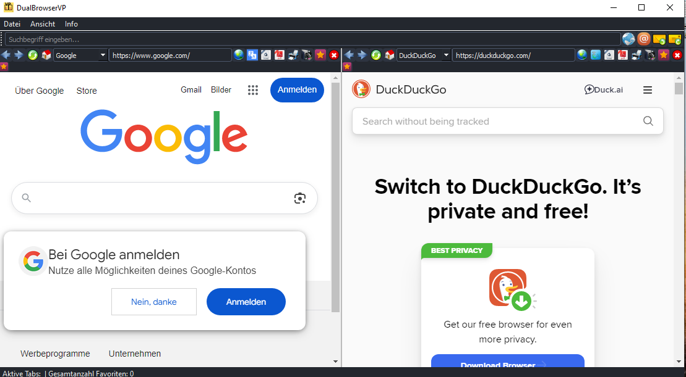

# 🚀 DualBrowserVP

### 📘 Multilingual README – EN | DE | SR

---

## 🇬🇧 English

**DualBrowserVP** is a lightweight Windows application for parallel browsing in two independent panels — perfect for researchers, analysts, and multitasking users.

### 🖼️ Screenshot

### 🔧 Features

- Dual browsing panels  
- Separate navigation per panel  
- Portable `.exe` executable  
- Simple and fast interface

### 📦 Files Included

| File | Description |
|------|-------------|
| `DualBrowserVP.exe` | Executable |
| `README.md` | Project description |
| `License.txt` | MIT License |
| `.gitignore` | Git config |
| `Dual_browser_DE.png` | Preview image |

### 📥 Download

👉 [Download the executable](https://github.com/VasoVale/DualBrowserVP/blob/main/DualBrowserVP.exe)

### 📄 License

MIT – Free to use, adapt, and share.

---

## 🇩🇪 Deutsch

**DualBrowserVP** ist ein schlankes Windows-Programm für paralleles Surfen in zwei unabhängigen Browser-Panels — ideal für Recherche, Analyse und Multitasking.

### 🖼️ Bildschirmfoto

### 🔧 Funktionen

- Zwei Browser-Panels  
- Separate Navigation für jedes Panel  
- Portable `.exe` Datei  
- Schnelle und einfache Bedienung

### 📦 Dateien im Repository

| Datei | Beschreibung |
|-------|--------------|
| `DualBrowserVP.exe` | Ausführbare Datei |
| `README.md` | Projektbeschreibung |
| `License.txt` | MIT-Lizenz |
| `.gitignore` | Git-Konfiguration |
| `Dual_browser_DE.png` | Vorschau-Bild |

### 📥 Download

👉 [Zum Herunterladen der ausführbaren Datei](https://github.com/VasoVale/DualBrowserVP/blob/main/DualBrowserVP.exe)

### 📄 Lizenz

MIT – Frei verwendbar, anpassbar und teilbar.

---

## 🇷🇸 Srpski

**DualBrowserVP** je jednostavan Windows alat za paralelno surfovanje u dva nezavisna panela — idealan za istraživače, analitičare i sve multitasking entuzijaste.

### 🖼️ Snimak ekrana

### 🔧 Glavne mogućnosti

- Dva browser panela  
- Samostalna navigacija za svaki panel  
- Prenosivi `.exe` fajl  
- Jednostavan i brz interfejs

### 📦 Sadržaj repozitorijuma

| Fajl | Opis |
|------|------|
| `DualBrowserVP.exe` | Izvršna datoteka |
| `README.md` | Opis projekta |
| `License.txt` | MIT licenca |
| `.gitignore` | Git konfiguracija |
| `Dual_browser_DE.png` | Slika interfejsa |

### 📥 Preuzimanje

👉 [Preuzmi izvršni fajl](https://github.com/VasoVale/DualBrowserVP/blob/main/DualBrowserVP.exe)

### 📄 Licenca

MIT – Slobodno koristi, prilagođavaj i deli.

---